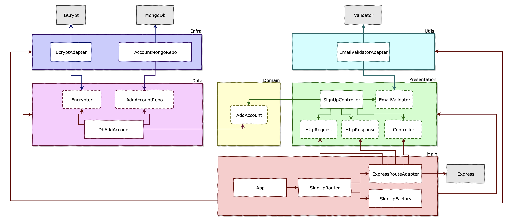

# clean-node-api (wip)

Sign up and Login API using TDD, Clean Architecture, Design Patterns and SOLID

## APIs

1. [Sign up](./requirements/signup.md)
2. [Login](./requirements/login.md)
3. (WIP) [Create survey](./requirements/add-survey.md)
4. (WIP) [List survey](./requirements/load-surveys.md)
5. (WIP) [Answer survey](./requirements/save-survey-result.md)
6. (WIP) [Survey result](./requirements/load-survey-result.md)
